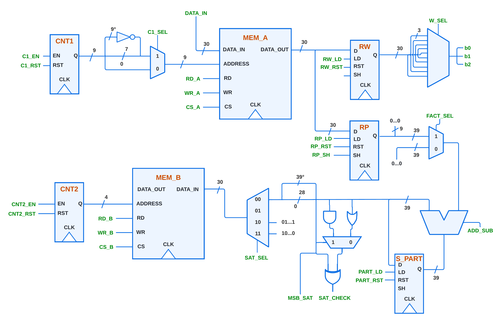
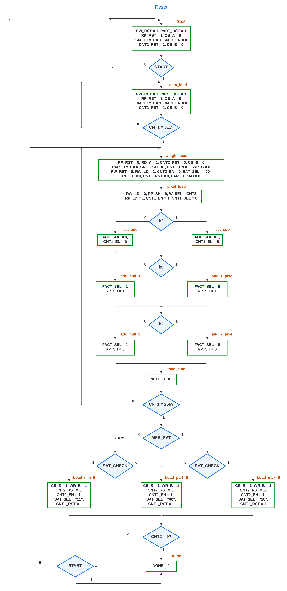

# Neural Network Hardware Implementation Repository

This repository contains an RTL implementation of a fully connected neural network for hardware classification tasks. The neural network is designed to classify handwritten digits from the MNIST dataset using a 16x16 pixel representation. This project includes the VHDL source code, simulation scripts, testbenches, and related documentation for the hardware implementation.

## Introduction

The implemented neural network consists of:
- **256 input neurons** (corresponding to the 256 pixels of the 16x16 image).
- **10 output neurons** (representing the digit classes, 0-9).
- **Synapses** that connect every input neuron to each output neuron, weighted by predefined values.

The architecture uses a single adder for arithmetic operations, ensuring efficiency and simplicity. A key feature is its ability to handle saturation of arithmetic results to fit the output into a 30-bit format. The design ensures accurate and efficient classification while adhering to strict hardware constraints.

### Detailed Implementation

#### Memory Architecture
- The neural network uses two RAM blocks:
  1. **MEM_A**: A 512-cell memory with 30-bit parallelism.
     - Stores input pixels in the first 256 cells and weights in the remaining 256 cells.
     - Each weight is encoded as a 3-bit signed value, allowing for nine weights per memory cell.
  2. **MEM_B**: A 10-cell memory with 30-bit parallelism.
     - Stores the final output results corresponding to each digit class (0-9).

#### Arithmetic Operations
- A **39-bit ripple carry adder/subtractor** performs all arithmetic operations. This bit width was carefully chosen based on a worst-case scenario analysis of cumulative pixel-weight products, ensuring no overflow during computation.
- The addition and subtraction are handled by a single module with a select line (`ADD_SUB`) to toggle between addition and subtraction.

#### Saturation Logic
- The outputs are saturated to ensure they fit within the 30-bit format. The saturation logic includes:
  - **Positive Saturation**: Triggered if the result exceeds the maximum 30-bit positive value.
  - **Negative Saturation**: Triggered if the result goes below the minimum 30-bit negative value.
- The saturation unit uses a combination of multiplexers and XOR gates to efficiently implement this logic.

#### Datapath
- The datapath includes:
  - **Registers**:
    - Input registers to hold pixel and weight data temporarily.
    - A partial sum register to accumulate intermediate results with 39-bit parallelism.
  - **Multiplexers**:
    - For selecting specific weights or input data.
    - For routing data to the adder or handling saturation.
  - **Control Signals**:
    - Generated by the control unit to manage the flow of data and synchronization.

A block scheme of the structure is shown here:


#### Control Unit
- The control unit operates based on an ASM (Algorithmic State Machine) chart, managing states like:
  - **Idle**: Waiting for the start signal.
  - **Data Load**: Loading input pixels and weights into MEM_A.
  - **Processing**: Performing pixel-weight multiplications and summations.
  - **Output Storage**: Writing the saturated results to MEM_B.
  - **Completion**: Generating a `DONE` signal once all outputs are calculated.

The ASM chart for the control unit is shown here:


### Algorithm Overview
1. Load the 256 input pixels and 256 weights into MEM_A.
2. For each output neuron:
   - Multiply each input pixel by its corresponding weight.
   - Accumulate the results using the adder.
   - Apply saturation if necessary.
   - Store the final result in MEM_B.
3. Signal completion with the `DONE` signal.

### Key Challenges and Solutions
- **Memory Utilization**:
  - Optimized to fit weights and inputs in a single RAM block by encoding multiple weights per cell.
- **Overflow Management**:
  - Performed detailed mathematical analysis to determine the required bit width and implemented saturation to handle overflows.
- **Synchronization**:
  - Used counters and flip-flops to ensure precise timing and synchronization across the datapath.

## Repository Structure

The repository is organized into the following directories and files:

```
.
├── docs
│   ├── ASM_ask.png         # Control unit ASM chart.
│   ├── DATAPATH.png        # Datapath diagram.
│   ├── report.pdf          # Project report with details of implementation.
│   └── timings/            # Timing analysis and performance data.
│       ├── Timing_1.png    # Example timing results.
│       └── ...
├── sim
│   ├── simulation.tcl      # TCL script for running simulations.
│   └── work/               # Directory for simulation-generated files.
├── src
│   ├── *.vhd               # VHDL source files (e.g., adders, multiplexers, etc.).
│   └── neural_network.vhd  # Top-level neural network module.
├── tb
│   ├── tb_low.vhd          # Testbench for low difficulty simulations.
│   └── tb_high.vhd         # Testbench for high difficulty simulations.
```

### Key Components
1. **`docs/`**: Contains the project report and diagrams describing the architecture, control unit, and datapath.
2. **`sim/`**: Houses the TCL script for automating the simulation process in ModelSim.
3. **`src/`**: Includes all RTL files describing the neural network and its components.
4. **`tb/`**: Contains testbenches for validating the neural network's functionality at different difficulty levels.

## Installation and Usage

To simulate and test the neural network:

1. **Pre-requisites**:
   - Install **ModelSim** or an equivalent VHDL simulation tool.
   - Ensure TCL scripting is enabled in your simulation environment.

2. **Clone the Repository**:
   ```bash
   git clone <repository_url>
   cd <repository_name>
   ```

3. **Run the Simulation**:
   - Open ModelSim and navigate to the `sim/` directory.
   - Execute the TCL script:
     ```bash
     do simulation.tcl
     ```

4. **Simulation Details**:
   - The TCL script automatically compiles all design files and testbenches.
   - It uses a command-line parameter `--difficulty` to select the testbench:
     - `--low`: Runs the simulation with `tb_low.vhd`.
     - `--high`: Runs the simulation with `tb_high.vhd`.
   - Example:
     ```bash
     vsim -do simulation.tcl --difficulty=--high
     ```

5. **Generated Outputs**:
   - Waveforms and simulation results are saved in the `work/` directory.
   - Observe the output neuron activations and verify the results against the expected values.

## Additional Information
- Refer to the [report.pdf](docs/report.pdf) for a detailed explanation of the neural network architecture, algorithm, and timing analysis.
- The datapath and control unit diagrams provide a comprehensive view of the implementation.

Feel free to contribute or raise issues for improvements!

